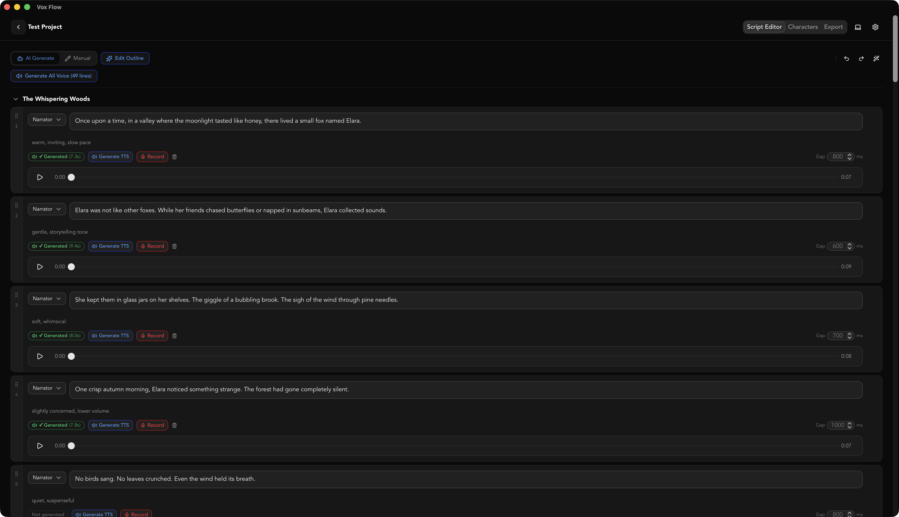

# 🎧 VoxFlow AI

VoxFlow AI is a desktop application designed to streamline the creation of audiobooks and audio content. Built with modern web and Rust technologies, it allows you to visually script, synthesize natural-sounding speech using Alibaba Cloud Bailian, and manage your audio projects with ease.

> **Note:** This application uses the **Alibaba Cloud Bailian (DashScope)** platform for its Text-to-Speech (TTS) capabilities. You will need a valid API Key from the platform to use the synthesis features.

[](./docs/demo-screenshot.png)

---

## ✨ Features

- 🎙️ **Alibaba Cloud Bailian Integration** — High-quality TTS synthesis powered by models like Qwen3 TTS Flash.
- 🎬 **AI Video Generation** — Automatically generate visually rich video accompaniments for your audiobook. The AI creates atmospheric motion graphics — geometric animations, gradient flows, kinetic typography — that complement the narration without cluttering the screen with text. Each section is rendered independently with audio-synced timing, then merged into a final video. Supports sleep mode audio processing for bedtime listening.
- ⚙️ **User-Configurable Settings** — Easily input your API Key, select models, and adjust default voice settings (speed, pitch, voice) directly from the application UI.
- ⏱️ **Adjustable Intervals** — Fine-tune the silence between script lines to ensure natural pacing.
- 💾 **Robust Data Management** — Built-in SQLite database ensures data integrity and prevents conflicts during manual script creation.
- 🖥️ **Modern Desktop Experience** — Powered by Tauri 2.0 for a lightweight, secure, and native feel.

---

## 🚀 Getting Started

Follow these instructions to get a local copy of the project up and running.

### Prerequisites

- [Node.js](https://nodejs.org/) (v18 or later)
- [Rust](https://www.rust-lang.org/) (latest stable version)
- [FFmpeg](https://ffmpeg.org/) (for audio/video processing)
- [Hyperframes](https://www.npmjs.com/package/hyperframes) (`npm install -g hyperframes` — used for HTML-to-video rendering)

### Installation

1. **Clone the repository:**

   ```bash
   git clone https://github.com/iMyth/VoxFlow.git
   cd VoxFlow
   ```

2. **Install dependencies:**

   ```bash
   # Install frontend dependencies
   pnpm install
   # Or: npm install
   ```

3. **Configure Bailian API:**

   Unlike many CLI tools, VoxFlow does not require you to set environment variables manually.
   - Launch the application (see [Development](#development) below).
   - Click the **Settings** (gear icon ⚙️).
   - Enter your **DashScope API Key** in the designated field.

---

## 🧑‍💻 Development

To start the application in development mode with hot-reloading:

```bash
npm run tauri:dev
```

This command will start both the Vite development server and the Tauri backend simultaneously.

---

## 🎬 Video Generation

VoxFlow generates visual accompaniment videos for each audiobook section:

1. **Audio merge** — Section audio fragments are concatenated with silence gaps, then measured via ffprobe to get the exact duration.
2. **LLM composition** — An AI agent generates an HTML/GSAP animation composition (via Hyperframes format) tailored to the content's mood and themes. The prompt emphasizes visual richness (6-10 elements/scene) while avoiding text-heavy subtitle-style output.
3. **Post-processing** — The generated HTML undergoes multiple safety passes:
   - Force-correct `data-duration` on the composition element (ignoring CSS selector false positives)
   - Force-set `window.__hf.duration` to the ffprobe-measured audio duration
   - Clamp any clip extending beyond the audio duration
   - Fix CSS font variables and ensure timeline registration
4. **Render** — `npx hyperframes render` converts the HTML to a silent MP4 (headless Chrome capture at 30fps).
5. **Audio merge** — FFmpeg merges the silent video with section audio using `-shortest` to guarantee the output matches audio length.
6. **Final merge** — All section videos are concatenated (with resolution normalization to 1920×1080 if needed) into the final output.

### macOS Note

On first run, macOS will prompt for **App Management** permission (required by headless Chrome). VoxFlow handles this automatically — it detects the permission failure, shows a toast notification, waits for you to grant access, and retries.

---

## 📦 Building for Production

To build the application for your platform:

```bash
npm run tauri:build
```

---

## 🛠️ Tech Stack

| Layer           | Technologies                                                                  |
| --------------- | ----------------------------------------------------------------------------- |
| **Frontend**    | React 19, TypeScript, Vite, Tailwind CSS, Zustand                             |
| **Backend**     | Rust, Tauri 2.0, Tokio, Rusqlite (SQLite)                                     |
| **AI Services** | Alibaba Cloud Bailian (DashScope), Qwen3-Plus (LLM), Hyperframes (HTML→Video) |

---

## 📄 License

This project is licensed under the [MIT License](./LICENSE).
